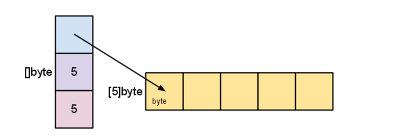
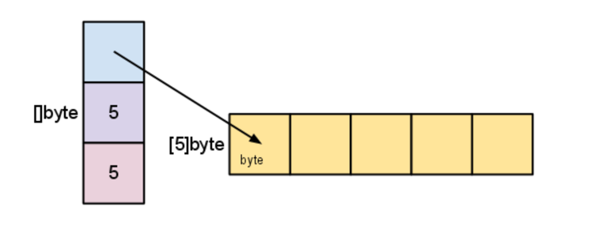
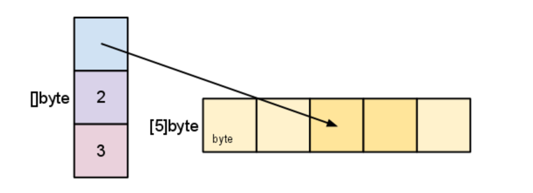
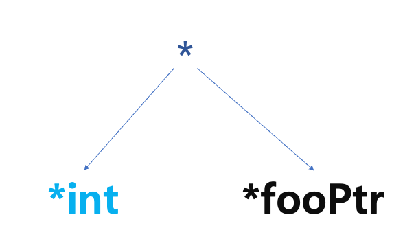

## Go 설치
* Go 언어는 공식 사이트(https://go.dev/doc/install)에서 다운로드 받아 설치하는 것을 권장합니다.
  * 패키지 매니저는 버전 업데이트가 너무 느리거나 중단한 경우가 많습니다. 
1. https://go.dev/dl/ 에서 PC 플랫폼용 바이너리를 찾아 다운로드 합니다. 
2. Microsoft Windows, macOS는 설치 패키지로 제공됩니다. 따라서, 다운로드한 파일을 실행하여 설치합니다. 
3. Linux 배포본은 다음의 명령어를 사용합니다.
* 기존 go 바이너리 삭제 및 신규 패키지 설치
```shell
$ sudo rm -rf /usr/local/go && sudo tar -C /usr/local -xzf go1.22.1.linux-amd64.tar.gz
```
* 실행 경로 추가
```shell
export PATH=$PATH:/usr/local/go/bin
```
4. 설치후 다음의 명령어로 원하는 go version 설치를 확인 합니다.
```shell
$ go version
```
> 출처: https://go.dev/doc/install

## 함수
* Go 언어의 함수는 func 키워드로 시작하고 함수의 이름, 시그니쳐, 구현 으로 구성됩니다.
* 함수와 변수의 첫 글자가 소문자이면 자바의 private와 같은 효과가 있어 같은 패키지에서만 접근이 가능합니다.
* 패키지 이름은 대소문자에 따른 영향이 없지만 관례상 소문자만 사용합니다.

## 패키지
* 패키지는 package 키워드로 정의합니다.
* 실행가능한 애플리케이션을 만들려면 main 패키지가 있어야 합니다.
* 다른 Go 패키지를 사용할때는 import를 사용합니다.
* 표준 라이브러리는 간단히 패키지 이름으로 가져 올 수 있습니다.
```go
import "fmt"
```
* 외부 패키지는 인터넷 주소를 써서 가져와야 합니다.
```go
import "github.com/dooray-go/dooray"
```
> 중요 : Go의 패키지와 Java의 패키지는 아주 다릅니다. 
> Go의 패키지 내에 여러 go 파일이 있는 경우, 각 파일에서 동일한 함수, 변수 선언이 불가능합니다.
> Go의 패키지는 java 파일 하나로 생각하면 조금 비슷합니다.
> 계속 진행해 보면 그다지 어려운 부분은 아니지만 처음에 조금 당황할 수 있습니다.

## 프로젝트 생성/빌드/실행
### 프로젝트 생성 
1. 프로젝트를 개발할 디렉토리를 생성하고 해당 디렉토리로 이동합니다. 
```shell
$ cd 
$ mkdir hello
$ cd hello
```
2. 프로젝트를 `go mod`로 생성합니다. (mod는 모듈이라는 말입니다.)
```shell
$ go mod init example/hello
go: creating new go.mod: module example/hello
```
3. 작업한 디렉토리에 hello.go 파일을 아래와 같이 생성합니다. (Copy & Paste)
```go
package main

import "fmt"

func main() {
    fmt.Println("Hello, World!")
}
```
### 프로젝트 빌드/실행
1. `go build`로 프로젝트를 빌드합니다. 빌드하면 hello (or hello.exe) 라는 실행파일이 생성되어 있습니다.
```shell
$ go build -o hello hello.go
```
2. hello 를 실행합니다.
```shell
$ ./hello
Hello, World!
```

### 컴파일 없이 실행하기
* python과 같은 인터프리터 언어의 사용자 경험을 제공합니다.
```shell
$ go run hello.go
Hello, World!
```
* `go run` 커멘드는 Go 패키지를 빌드하고 임시 실행 파일을 만든 후 해당파일을 실행하고 실행이 끝나면 지워버립니다.
* go의 컴파일 속도는 매우 빨라서 스크립트 언어로 오해할 정도입니다.

> 출처 : https://go.dev/doc/tutorial/getting-started
>

## 외부 패키지 호출
* 위 프로그램에서 출력하는 내용을 두레이메신저로 발송하는 작업을 해보겠습니다.
1. https://pkg.go.dev 사이트에서 dooray-go를 검색합니다.
2. 검색결과 상단에서 "github.com/dooray-go/dooray" 를 복사합니다.
3. 다음과 같이 hello.go 를 수정합니다. (배우지 않은 문법은 신경쓰지 않습니다.!!)
### (e1)
```go
package main

import "github.com/dooray-go/dooray"

func main() {
    dooray.PostWebhook(
        "https://hook.dooray.com/services/3036349505739914786/3770555218093552684/autJQopeRTiVWUNxrgfaFA",
        &dooray.WebhookMessage{
            BotName: "Manty",
            Text:    "Hello, World!"},
    )
}
```
4. 새로운 모듈을 go.sum, go.mod 에 추가합니다. 추가하기 위한 명령어는 아래와 같습니다.
```shell
$ go mod tidy
```
5. 수정한 코드를 실행합니다.
```shell
$ go run hello.go
```

## 중요한 형식과 코딩 규칙
* Go는 실수를 방지하도록 엄격한 코딩 규칙을 적용합니다.
* Go가 제공하는 표준 도구(gofmt)를 제공해 형식은 자동으로 조정할 수 있습니다.
### 코딩 규칙
* 패키지를 임포트 하면 해당 패키지 기능을 사용해야 합니다.
* 변수를 선언했다면 반드시 사용해야 합니다..
* 중괄호를 사용하는 형식은 1가지 방법 밖에 없습니다.
```go
package main

import(
    "fmt"
)

// 컴파일 오류가 발생합니다.
func main()
{
    fmt.Println("Go has strict rules for curly braces!")
}
```
* 코드가 한문장이거나 아예 존재하지 않더라도 코드 블록은 중괄호로 감싸야 합니다.
* 함수는 여러 개의 값을 반환할 수 있습니다.
* 같은 종류의 데이터일지라도 다른 데이터 타입으로 자동 변환되지 않습니다. (정수를 부동소수점으로 자동변환하지 않습니다.)

## 변수 선언
* var 키워드를 사용합니다.
```go
var count int
```
* 초기 값이 있다면 데이터 타입은 생략할 수 있습니다. 
```go
var count = 1
```
* var 키워드 대신 := 을 이용해서 변수를 선언할 수 있습니다. 데이터 타입은 추론합니다.
* 전역 변수에는 이 형식을 사용할 수 없습니다.
```go
// short assignment
count := 1
```

## 변수 출력
* 화면(stdout)에 데이터를 출력하려면 fmt.Println() 함수를 사용합니다. 자바의 System.out.println()와 비슷합니다.
* fmt.Printf()는 자바의 System.out.printf()와 비슷한 기능을 가지고 있습니다. 

### (e2)
```go
package main

import (
    "fmt"
    "math"
)

// int 타입의 전역변수
var Global int = 1234
//두번째 전역변수, 타입은 int로 추론, ANOTHER_GLOBAL로 이름을 짓지 말것
var AnotherGlobal = -5678

func main() {
    // int 타입의 지역변수 0으로 초기화
    var j int
    // i 도 int 가 된다.
    i := Global + AnotherGlobal
    fmt.Println("Initial j value:", j)
    j = Global

    // math.Abs() int64 매개변수가 필요합니다. 명시적으로 변환합니다.
    k := math.Abs(float64(AnotherGlobal))
    
    // 형식을 잘 보세요.
    fmt.Printf("Global=%d, i=%d, j=%d, k=%.2f.\n", Global, i, j, k)
}
```

* output
```
Initial j value: 0
Global=1234, i=-4444, j=1234, k=5678.00.
```

## 흐름 제어
### if/else
* 조건문에 괄호를 사용하지 않습니다.
```go
err := anyFunctionCall()
if err != nil {
    // 에러 처리
}
```
>java 에서의 null 은 Go 에서 nil 입니다. 

### switch
* Go의 switch 문은 두 가지 타입이 있습니다.
* Go는 Java와 달리 case의 조건이 맞으면 break 가 없어도 다음 조건을 실행하지 않습니다. 
* 다음 조건을 계속 평가하고 싶다면  fallthrough 를 사용합니다.
1. switch 문이 평가할 표현식을 가진 경우
#### (E3)
```go
switch argument {
case "0":
    fmt.Println("Zero")
case "1":
    fmt.Println("One")
case "2", "3", "4":
    fmt.Println("2 or 3 or 4")
    fallthrough
default:
    fmt.Println("Value:", argument)
}
```

2. switch 문에는 표현식이 없고 case 문에 평가 표현식이 있는 경우
#### (E4)
```go

    value, err := strconv.Atoi(argument)
    if err != nil {
    fmt.Println("Can not convert to int:", argument)
    return
    }

	switch {
	case value == 0:
		fmt.Println("영")
	case value > 0:
		fmt.Println("양의 정수")
	case value < 0:
		fmt.Println("음의 정수")
	default:
		fmt.Println("이 조건에 올 수 없습니다.", value)
	}
```

### 반복문
* Go는 반복문으로 for 키워드만 제공합니다. (while 이 없습니다.)
#### 구구단의 2단 (E5)
```go
package main

import "fmt"

func main() {
	for i := 1; i < 10; i++ {
		fmt.Printf("%d X %d = %d \n", 2, i, 2*i)
	}
}
```
* range를 사용하면 slice map 등의 데이터 타입 처리에 반복코드를 제거할 수 있습니다.
#### 슬라이스에서 데이터 읽기 (E6)
```go
  aSlice := []string{"tesla", "nvidia", "apple", "microsoft"}

  for i, v := range aSlice {
  fmt.Printf("Index : %d, Value : %s\n", i, v)
  }
```

## 데이터 모델
* 대표적으로 Array, Slice, Map 을 제공합니다. 

## Array
* 배열을 만든 뒤에는 크기를 수정할 수 없습니다.
* 정의할때 항상 크기를 표시해야 합니다. 
```go
firstArray := [4]string{"One", "Two", "Three", "Four"}
```
* 또는, [...]으로 컴파일러에게 이 정의가 배열임을 알려 주어야 합니다.
```go
secondArray := [...]string{"One", "Two", "Three", "Four"}
```
* Array를 함수로 넘길때 배열의 새로운 복사본을 만들어 함수에 전달합니다. 함수에서 배열을 변화시킨 내용은 원래 함수에 반영되지 않습니다.
* 결론적으로 강력하지 않은 Go의 배열을 잘 쓰이지 않습니다. Slice로...

## Slice
* 배열과 유사하지만 생성 후에 필요하다면 크기가 커지거나 작아질 수 있습니다.
* 슬라이스는 배열을 기반으로 구축된 추상화 입니다.
  * 슬라이스 값은 데이터의 길이, 용량, 내부 배열의 포인터를 갖고 있습니다.

```go
type SliceHeader struct {
	Data uintptr
	Len  int
	Cap  int
}
```


* Slice를 함수로 넘길때 헤더만 복사하기 때문에 슬라이스 데이터를 복사해 전달하는 것 보다 성능이 좋습니다.

### 슬라이스의 선언
* 슬라이스는 요소 개수를 생략한다는 점을 제외하면 배열과 동일하게 선언됩니다.
```go
aSlice := []string{"One", "Two", "Three", "Four"}
```

* 또는, make 내장함수를 이용해서 선언할 수 있습니다. 
```go
func make([]T, len, cap) []T
```
* make 로 슬라이스 선언하기
```go
var s []byte
s = make([]byte, 5, 5)
```
* 용량 인수를 생략하면 길이와 동일한 용량이 생성됩니다.
```go
s := make([]byte, 5)
```
* cap, len 내장함수를 사용하여 용량과 길이를 확인할 수 있습니다. 
```go
len(s) == 5
cap(s) == 5
```

* 슬라이스는 기존 슬라이스를 잘라낸 새 슬라이스를 만들 수 있습니다. 
* 콜론(:) 으로 시작 인덱스와 종료 인덱스를 지정하여 잘라낼 수 있습니다. (half-open range)
> half-open range : 시작 인덱스는 포함하고 종료 인덱스는 포함하지 않는 범위
```go
b := []byte{'g', 'o', 'l', 'a', 'n', 'g'}
// b[1:4] == []byte{'o', 'l', 'a'}
```
* 잘라내기를 할때, 시작 인덱스나 종료 인덱스를 생략하여 0 또는 슬라이스의 길이를 의미할 수도 있습니다.
```go
// b[:2] == []byte{'g', 'o'}
// b[2:] == []byte{'l', 'a', 'n', 'g'}
// b[:] == b
```
* 슬라이스를 잘라내면 데이터 배열을 새로 생성하는 것이 아니라 시작 인덱스만 바꾸게 됩니다.

* b[2:4]

* 따라서 잘라낸 슬라이스 데이터의 값을 바꾸면 기존 슬라이스의 데이터도 변경됩니다.
```go
d := []byte{'g', 'o', 'l', 'a', 'n', 'g'}
e := d[3:]
// e == []byte{'n', 'g'}
e[1] = 'd'
// e == []byte{'n', 'd'}
// d == []byte{'g', 'o', 'l', 'a', 'n', 'd'}
```
### 슬라이스 크기 변경
* 슬라이스의 용량을 늘이는 것은 "큰 새 슬라이스를 생성"하고", "데이터를 복사"하는 순서로 이루어 집니다. 
  * 대부분의 언어에서 동적 배열 구현에서 사용하는 방식입니다. 
```go
t := make([]byte, len(s), (cap(s)+1)*2) // +1 in case cap(s) == 0
for i := range s {
        t[i] = s[i]
}
s = t
```
* 보통 슬라이스 맨 끝에 데이터를 추가하는 작업을 많이 하기때문에 append 라는 내장함수가 제공됩니다. 
```go
func append(s []T, x ...T) []T
```
* 슬라이스 마지막에 원소를 추가하기(List.add)
```go
a := make([]int, 1)
// a == []int{0}
a = append(a, 1, 2, 3)
// a == []int{0, 1, 2, 3}
```
* 슬라이스 마지막에 다른 슬라이스 원소 전체를 추가하기(List.addAll)
```go
a := []string{"John", "Paul"}
b := []string{"George", "Ringo", "Pete"}
a = append(a, b...) // equivalent to "append(a, b[0], b[1], b[2])"
// a == []string{"John", "Paul", "George", "Ringo", "Pete"}
```
> Java 의 ArrayList를 사용하는 곳에서 사용하면 됩니다.

> 출처 : https://go.dev/blog/slices-intro

## Map
* go는 HashTable을 구현한 내장 map 을 제공합니다.
* ConcurrentHashMap 처럼 동시성을 지원하지 않습니다.
### map 선언과 초기화
* string 타입을 키로, int 타입을 값으로 m 변수를 선언하는 방법은 다음과 같습니다.
```go
var m map[string]int
```
* map은 slice 와 같이 참조 타입이므로 초기화 하지 않은 맵을 읽으려고 하면 nil을 반환하지만 값을 주입하려고 하면 Runtime Panic 이 발생합니다.
* 내장 make 함수를 이용하여 초기화를 해야 합니다.
```go
m = make(map[string]int)
```
### map의 사용
* 값 설정
```go
m["manty"] = 1
```
* 값 조회
```go
i := m["manty"]
j := m["comtin"] 
// j == 0
```
* map의 항목수
```go
n := len(m)
```
* 항목 제거
```go
delete(m, "manty")
delete(m, "comtin")
// error 가 발생하지는 않음
```
* 항목 존재여부(contains)
```go
i, ok := m["manty"]
// ok == true
```
* 항목 존재여부만 확인하려면
```go
_, ok := m["manty"]
// ok == true
```
* map의 내용을 loop로 순회하려면
```go
for key, value := range m {
    fmt.Println("Key:", key, "Value:", value)
}
```
* 다른 초기화 방법
```go
score := map[string]int{
    "manty":  100,
    "comtin": 101,
}
```
### 동시성 처리
* map 은 동시성을 지원하지 않습니다. 이를 위해서 보통은 sync.RWMutex을 사용하여 부분적인 lock 을 설정합니다.
```go
var counter = struct{
    sync.RWMutex
    m map[string]int
}{m: make(map[string]int)}
```
* 읽음 처리
```go
counter.RLock()
n := counter.m["some_key"]
counter.RUnlock()
fmt.Println("some_key:", n)
```
* 쓰기 처리
```go
counter.Lock()
counter.m["some_key"]++
counter.Unlock()
```
* 3rd Party - 동시성 처리를 지원하는 외부 라이브러리 중에 다음의 라이브러리가 많이 사용됩니다.
  * https://github.com/orcaman/concurrent-map
  * 동시 처리의 속도를 높이기 위해 map 을 SHARD 로 나누어 구현되었습니다.

> 출처 : https://go.dev/blog/maps

## type - 구조체
### 구조체 정의
* 여러 값의 집합을 하나의 데이터 타입으로 묶어 하나의 객체처럼 주고 받는 방법입니다. 
* 구조체는 새로운 데이터 타입이므로 type 키워드를 사용하고 구조체의 이름, struct 키워드를 사용해야 합니다.
```go
type Student struct {
    Id   int64
    Name string
}
```
### 구조체 타입 변수 초기화
* new() 키워드
  * 적절한 메모리 공간을 할당하고 제로 값으로 만든다.
  * 할당된 메모리의 포인터를 반환한다.

* 구조체는 구조체 이름과 중괄호를 이용해서 초기화 할 수 있습니다. 
  * 초기값을 입력하지 않으면 컴파일러가 필드의 타입별 제로 값을 할당합니다.
#### 구조체 타입 변수(E8)
* new 키워드로 구조체 초기화
```go
	// Student 구조체 포인터 생성
	mantyPtr := new(Student)
	mantyPtr.Id = 1
	mantyPtr.Name = "manty"
	fmt.Println(mantyPtr)
```
* zero 값으로 구조체 초기화
```go
	zero := Student{}
	fmt.Println(zero)
```
* 필드값을 가진 구조체 초기화
```go
	comtin := Student{
		Id:   2,
		Name: "comtin",
	}
	fmt.Println(comtin)
```
* 구조체 포인터 생성
```go
	comtinPtr := &Student{
		Id:   2,
		Name: "comtin",
	}
	fmt.Println(comtinPtr)
```

## 오류 처리
* Go 언어에는 Java 의 throws, throw, try-catch-finally 와 같은 키워드가 없습니다.
* 함수의 호출 결과에 오류가 발생했을 때는 error 타입으로 반환할 수 있습니다. 
* 예를 들어 파일을 열때, Open 이라는 함수를 사용합니다.  
```go
func Open(name string) (file * File, err error)
```
* 이 함수는 2개의 반환타입을 가집니다. 함수 호출결과가 정상이라면 file을 반환하고 err는 nil로 반환합니다.
* Open 함수 실행 중에 오류가 발생하면 err 에 에러 정보가 포함됩니다.
* go 언어에서 다음의 코드는 Java의 try-catch 문과 같이 자주 나타납니다.
```go
f, err := os.Open("filename.ext")
if err != nil {
  log.Fatal(err)
}
```

### error 타입
* error는 내장 인터페이스 타입 입니다. 
```go
type error interface {
	Error() string
}
```

* defer


> 출처: https://github.com/astaxie/build-web-application-with-golang/blob/master/en/11.1.md

## 포인터
* 포인터만 보면 화가나는 분?
### 문법
* 변수를 선언한다면 타입, 변수의 이름, 초기값의 형태입니다. 
* 이 변수의 값은 메모리 어딘가에 저장될 것입니다. 
* 메모리 어딘가에 저장되는 그 장소는 찾아가기 위해 주소도 정해집니다. 
```go
var foo int = 23
```
* 그 주소는 & 연산자를 이용해서 알 수 있습니다. 
```go
fmt.Println(foo, &foo)
```
* 출력값에서 값과 변수의 값을 저장하기 위한 주소를 확인할 수 있습니다.
```
23 0x14000110018
```
* 주소값은 포인터로 선언한 변수에 담을 수 있습니다. 
```go
	var fooPtr *int = &foo
	fmt.Println(fooPtr)
```
* 이제 주소에서 가리키는 실제 값을 가져와 보겠습니다. (dereference - *)
```go
    fmt.Println(*fooPtr)
```
* 포인터에서 * 표시는 두가지 용도로 사용됩니다. (혼란) 

* 별을 포인터 타입 앞에서 사용하면 포인터 타입을 선언한 것이 됩니다. 
* 별을 변수 앞에 사용하면 포인터 변수의 실제 값을 가져오는 연산자의 역할을 합니다. 

* 만약 다음과 같이 포인터의 값(*fooPtr)을 새로운 값으로 바꾸면 foo 역시 값이 바뀌어 있음을 알 수 있습니다. 
```go
    var foo int = 23
    var fooPtr *int = &foo
    
	*fooPtr = *fooPtr / 2
	fmt.Println(foo)
```

### 이렇게 복잡한 포인터를 왜 사용하나요?
* 변수를 한 메모리에 저장하고 여러곳에서 사용하는 것이 메모리 사용량 측면에서 효율적입니다. 
* 변수를 정해 두고 함수 호출 전반에서 값을 조작하려면 포인터를 사용하는 것이 편리합니다. 

### call by value, call by reference
* 다음과 같이 함수를 작성했다면 메인함수에서  plusOneValue(v int) 함수를 호출할때 v 변수를 복사해서 전달합니다. 
* 이 복사한 값은 호출 스택 내에서만 존재하기 때문에 함수 밖에 영향을 줄 수 없는 불변성을 가집니다. 
```go
func plusOneValue(v int) {
	v += 1
	fmt.Println(v)
}
```

* 이 함수를 다음과 같이 수정한다면, 우리가 Java 의 객체를 전달했을 때와 같이 v 포인터 변수의 값은 공유하게 되고 그 내용을 변경하면 호출 스택 밖에도 영향을 줍니다. 
```go
  func plusOnePointer(v *int) {
      *v += 1
      fmt.Println(*v)
  }
````
* 포인터는 효율성을 지향하고, 값 변수는 안정성을 지향한다고 볼 수 있습니다.

### 포인터 반환
* 다음의 코드에서 Init() 함수가 반환하는 Student 타입의 데이터는 반환시 main() 함수가 실행되는 스택으로 복사됩니다. 
```go
package main

import "fmt"

type Student struct {
}

func Init() Student {
	var student = Student{}
	return student
}

func main() {
	student := Init()
	fmt.Println(student)
}
```
* 하지만 Init() 함수가 Student 타입의 포인터를 반환하면 상황은 달라집니다.
* 포인터를 반환하는 순간 Init() 함수의 스택이 사라지므로 student 변수의 데이터를 유지하기 위해 Go컴파일러는 student 데이터를 힙으로 이동시킵니다.
```go
package main

import "fmt"

type Student struct {
}

func Init() *Student {
	var student = Student{}
	return &student
}

func main() {
	student := Init()
	fmt.Println(student)
}

```

* 스택으로 전달되는 과정을 확인해 보려면 다음의 명령으로 실행해 보면 알 수 있습니다.
```go
$ go build -gcflags '-m'
# go_for_spring_developer/00-1-go-basic/e9-1
./pointer_return.go:8:6: can inline Init
./pointer_return.go:14:17: inlining call to Init
./pointer_return.go:15:13: inlining call to fmt.Println
./pointer_return.go:9:6: moved to heap: student
./pointer_return.go:14:17: moved to heap: student
./pointer_return.go:15:13: ... argument does not escape
```
* 스택의 데이터를 힙으로 이동하는 부분을 위의 내용으로 확인 할 수 있습니다.
* 힙에 전달된 메모리는 가비지 컬렉션 대상이 되고, 성능에 영향을 주기 때문에 필요한 경우가 아니면 포인터를 사용하지 않는 것이 좋습니다.
