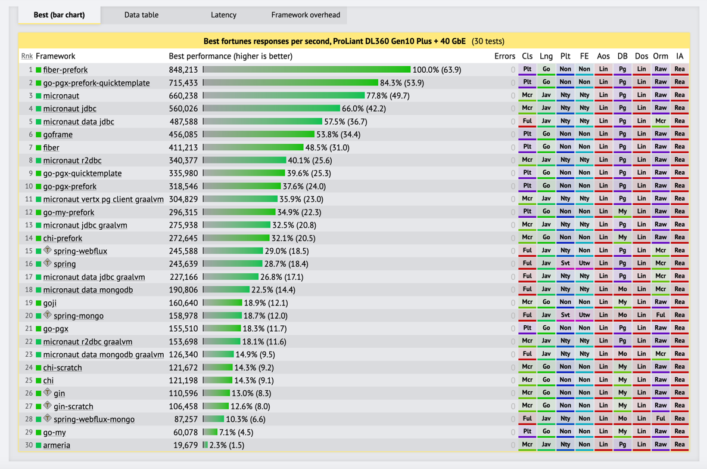

## 과정 개요
* 언어를 배우는 것은 쉽지 않습니다. 
* 영유아의 언어를 배우는 과정은 문법을 먼저 배우는 것이 아니라 부모의 언어를 듣기, 따라하기로 시작합니다. 
* 그 뒤에 문법을 배우고, 타인의 말하는 다양한 방법을 접하고 나서야 고급스러운 언어를 구사할 수 있습니다. 
* 외국어의 경우, 자신이 구사하는 네이티브 언어를 외국어와 비교하면서 배우면 훨씬 이해가 쉽고 빠르게 배울 수 있습니다. 

## 시작 
* 스프링 개발자를 대상으로 생각해보면 java는 모국어입니다. 
* 스프링 프레임워크는 언어를 고급스럽게 사용하는 방법이라고 볼 수 있습니다. 
* Go 언어를 배울때 스프링 프레임워크와 대응 되는 부분으로 설명하면 이해가 매우 빠르고, 고급스러운 활용도 빠르게 진행할 수 있습니다.
* 1:1 로 대응되는 부분과 그렇지 않은 부분이 있지만 최대한 적응 하기 쉽도록 진행합니다.

## 왜? Go 언어인가?
* 소프트웨어 엔지니어링을 더 쉽게 만들어주는 간단하고 읽기 쉬운 언어
* 클라우드에서 소프트웨어의 성능을 더 향상시킬 수 있는 언어
* 러닝 커브가 낮다 (cf. Rust)
  * Go는 25개 키워드만으로 구성
* 메모리 효율
    * 이건 Micro Services 아키텍쳐에서 중요한 부분
    * java 시스템 사용량예시 (CPU 보다 메모리 점유율이 너무 높아 비용 상승)
    * https://programming-language-benchmarks.vercel.app/
* 성능
  * 대부분의 Java 플랫폼 보다 빠른 성능(latency)
  * https://www.techempower.com/benchmarks/#hw=ph&test=fortune&section=data-r23&l=zijo8v-cn3&f=ziig3j-zik0zj-zik0zj-zijzen-zik0xr-zik0zj-qmx0qn-zh5gin-zijocf-zik0zj-zik0zj-ytl1j3-zik0zj-zik0zi-zik0zj-3j
  
* 성능과 메모리 사용량 비교
  * https://youtu.be/8CiErLxdaA8?si=hGcrbaLgeMQwFNPP

## Go 언어에서 Software Engineering 이란?
* 많은 사람들이 많은 시간을 들여 작업하는 대규모 프로그래밍에 관한 것.
* 신뢰할 수 있고 유지보수가 가능한 프로그래밍 필요
* 수년에 걸쳐 변경할 수 있어야 하며 새로운 사람을 고용하더라도 우리 프로그램을 빨리 이해할 수 있어야 함.

## Go의 설계 목표
* Go는 동적타입 인터프리터 언어의 쉬운 프로그래밍 장점과 정적타입 컴파일 언어의 성능과 안정성을 조합하기 위한 시도입니다. 

## Multi Core
* Multi Core에 환경에 최적화된 언어입니다. 
  * Multi Core 세상은 2005년 부터 시작되었다.
  * 대부분의 인기 있는 언어는 훨씬 이전에 개발되었다.
 
## Built For Cloud
* 인프라스트럭쳐를 위한 기본언어로 쓰이고 있다. 
  * Docker, Kubernetes, Helm, Drone, Rancher, Prometheus, Grafana, ...
* 성능도 좋지만 배포가 간단하다. 
  * VM이 필요하지 않고, libc 등 OS 의존성이 적어 작은 크기의 컨테이너 이미지를 만들 수 있다.
  

