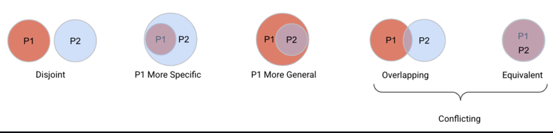

## Multiplexers
* HTTP 서버와 애플리케이션을 구현할때, 일반적으로 다양한 엔드포인트에 대한 요청을 별도의 핸들러로 라우팅하려고 합니다. 
* 이 라우팅을 처리하는 구성을 일반적으로 줄여서 "멀티플렉서" 또는 "mux" 라고 합니다. Go 에서는 ServeMux 타입이 이 라우팅을 로직을 처리합니다. 
<br />
* 기본으로 특별히 지정하지 않으면 DefaultServeMux 를 사용합니다. 

```go
package main

import (
	"io"
	"net/http"
	"log"
)

// hello world 를 응답합니다.
func HelloServer(w http.ResponseWriter, req *http.Request) {
	io.WriteString(w, "hello, world!\n")
}

func main() {
    // DefaultServeMux 에 /hello 엔드포인트와 HelloServer를 매핑합니다.
	http.HandleFunc("/hello", HelloServer)
    // ListenAndServe 의 두번째 인자가 nil 일때 DefaultServeMux 를 사용합니다.
	log.Fatal(http.ListenAndServe(":8080", nil))
}
```
## Custom ServeMux
* 애플리케이션의 라우팅을 처리하는 ServeMux를 정의할 수 있습니다. 다음은 애플리케이션에 대한 다양한 요청을 처리하기 위한 사용자 정의의 예입니다.
```go
package main

import (
	"fmt"
	"log"
	"net/http"
)

type membersHandler struct{}

func (m *membersHandler) ServeHTTP(w http.ResponseWriter, r *http.Request) {
	fmt.Fprintf(w, "members handler called")
}

type groupsHandler struct{}

func (g *groupsHandler) ServeHTTP(w http.ResponseWriter, r *http.Request) {
	fmt.Fprintf(w, "groups handler called")
}

func main() {
	mh := &membersHandler{}
	gh := &groupsHandler{}

	mux := http.NewServeMux()
	mux.Handle("/members", mh)
	mux.Handle("/groups", gh)
	mux.HandleFunc("/", func(w http.ResponseWriter, r *http.Request) {
		fmt.Fprintf(w, "welcome!!")
	})

	log.Fatal(http.ListenAndServe(":8080", mux))
}
```
* 클라이언트를 사용하여 위에 나열된 경로에 대해 여러 요청을 발송하고 각각에 대해 다른 응답을 확인합니다. 


## Custom ServerMux 의 Http Method 라우팅
### 1.21 이전 버전
* handler는 모든 Http Method 에 대해 응답하기 때문에 handler 내부에 처리할 수 없는 Method 는 405(Method Not Allowed) 처리를 하거나 분기를 해야 합니다.
```go
func (g *groupsHandler) ServeHTTP(w http.ResponseWriter, r *http.Request) {
	if r.Method != http.MethodGet {
		http.Error(w, "Method Not Allowed", http.StatusMethodNotAllowed)
		return
	}
	fmt.Fprintf(w, "groups handler called")
}
```

### 1.22 이후 
* func (mux *ServeMux) Handle(pattern string, handler Handler) 함수의 pattern 파라미터의 스팩이 다음의 Proposal 로 변경되어 Http Method 라우팅도 기술 할 수 있게 되었습니다. 
* https://github.com/golang/go/discussions/60227
* 따라서 다음과 같이 코드를 작성하여 Http Method 를 지정할 수 있습니다. 
```go
    dh := &departmentPostHandler{}
    mux.Handle("POST /departments", dh)
```
* GET 메소드는 HEAD 메소드 요청도 처리합니다.


## SpringMVC 의 @PathVariable 은?
* Go 언어에서 URL의 일부분을 와일드 카드로 두고 처리하는 것을 지원합니다.
* 와일드 카드는 / 사이의 전체 경로 이어야 합니다. 예를 들어 `/departments/qa_{seq}`와 같은 형태는 지원하지 않습니다.
* 전달한 와일드 카드를 얻어내기 위해 http.Request에 두 개의 메소드가 추가되었습니다. 
```go
package http

func (*Request) PathValue(wildcardName string) string
func (*Request) SetPathValue(name, value string)
``` 
* PathValue 타입 메소드는 와일드 카드의 키 이름으로 값을 찾아오는 기능을 제공합니다.
```go
departmentId := r.PathValue("id")
```
* SetPathValue 는 r.PathValue의 응답을 바꾸기 위해 존재합니다. 

## 우선순위
* 패턴이 겹치는 경우, 구체적인 패턴이 우선순위를 가집니다.
* 패턴이 충돌하고 한쪽 패턴이 호스트를 가진 경우, 호스트를 가진 경우가 우선합니다. 


### 예
* "dooray.com/" 와 "/" 중에는 호스트를 가진 "dooray.com/" 패턴이 우선합니다.
* "GET /" 와 "/" 중에는 Http 메소드를 가진 "GET /" 이 더 구체적입니다.
* HEAD 요청이 왔을때, "HEAD /" 와 "GET /" 중에 HEAD 가 더 구체적입니다. 
* "/b/{bucket}/o/default" 와 "/b/{bucket}/o/{noun}" 중에는 "/b/{bucket}/o/default" 이 더 구체적인 패턴입니다.

* "/b/{bucket}/{verb}/default" 과 "/b/{bucket}/o/{noun}" 은 충돌입니다.
  * "/b/k/o/default" 요청 때문에 중복됩니다.
  * "/b/k/a/default" 요청과 같은 형태 때문에 첫번째 패턴이 더 구체적이라고 볼 수 없습니다.
  * "/b/k/o/n" 요청과 같은 형태 때문에 두번째 패턴이 더 구체적이라고 볼 수 없습니다.

## 우선순위 연습
* 다음의 패턴이 등록되어 있다면 우선순위를 생각해 볼 필요가 있습니다.
```
1. /item/
2. POST /item/{user}
3. /item/{user}
4. /item/{user}/{id}
5. /item/{$}
6. POST alt.com/item/{user}
```

* "/item/jba" 요청은 3번 패턴과 매칭됩니다. 1번 패턴에 매칭이 되지만 3번이 더 구체적입니다. 
* POST "/item/jba" 요청은 2번 패턴과 매칭됩니다. 3번 패턴과도 매칭되지만 명시적인 Http 메소드가 있어서 더 구체적입니다.
* POST "/item/jba/17" 요청은 4번 패턴과 매칭됩니다. 다른 패턴들 보다 가장 구체적입니다.
* "/item/" 요청은 5번 패턴과 매칭됩니다. 1번에 비해 더 구체적입니다. 
* "/item/jba/17/line2" 은 1번에 매칭됩니다. 다른 패턴과는 매칭되지 않습니다. 
* POST 요청으로 호스트는 "alt.com" 이고 패스는 "/item/jba" 이면 6번과 매칭됩니다. 2번에 비해 더 구체적입니다. 
* GET 요청으로 호스트는 "alt.com" 이고 패스는 "/item/jba" 이면 매칭되는 패턴이 없습니다.

## WorkShop (e3/w1)
* 다음의 API 스펙을 만족하는 웹서비스를 작성하세요.
### API 스펙
* GET /members
  * response
```
You reqeuted url=/members, method=GET
```

* GET /members/{id}
  * response
```
You reqeuted url=/members/1, method=GET
```
* POST /members
    * response
```
You reqeuted url=/members, method=POST, body=brabra
```
* DELETE /members/{id}
```
You reqeuted url=/members/1, method=DELETE
```


