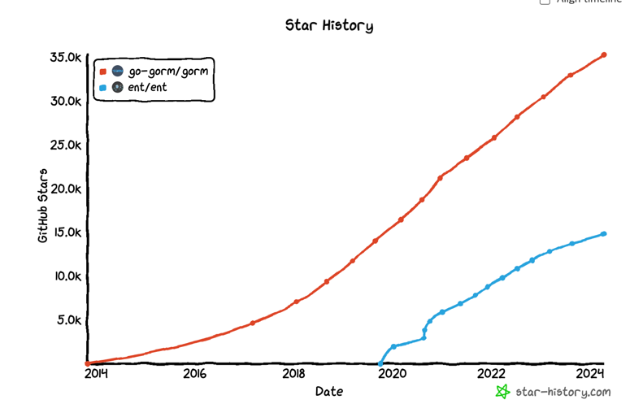

## An entity framework for Go
* https://entgo.io/
* facebook 내부에서 사용하다가 오픈소스화 한 것으로 알려져 있습니다.
* Simple, yet powerful ORM for modeling and querying data.

### github star history
* 202년 이후 github star가 많아지고 있습니다. 하지만 여전히 gorm 을 많이 사용하고 있는 것으로 판단됩니다.


* `go run -mod=mod entgo.io/ent/cmd/ent new --target 06-database/e2/ent/schema User` 을 실행하여 User 스키마를 생성할 수 있습니다.
## 실습

```go
package main

import (
	"context"
	"log"

	"go_for_spring_developer/06-database/e2/ent"

	_ "github.com/go-sql-driver/mysql"
)

func main() {
	client, err := ent.Open("mysql", "root:test@tcp(127.0.0.1:13306)/test?parseTime=True")
	if err != nil {
		log.Fatalf("failed opening connection to mysql: %v", err)
	}
	defer client.Close()
	// Run the auto migration tool.
	if err := client.Schema.Create(context.Background()); err != nil {
		log.Fatalf("failed creating schema resources: %v", err)
	}
}
```
## 작업순서

1. User 에 필드를 추가합니다.
2. Project Home 에서 go generate ./... 을 실행합니다.
3. 위 코드를 복사한 후, 실행합니다. 
4. mysql 에 접속하여 테이블 생성을 확인합니다. 
```shell
$ docker exec -it edu-mysql mysql -u root -p
```

## Edge 추가
* 새로운 테이블을 선언하려면 ent CLI 를 실행합니다.
```shell
$ go run -mod=mod entgo.io/ent/cmd/ent new --target 06-database/e2/ent/schema Car
```

