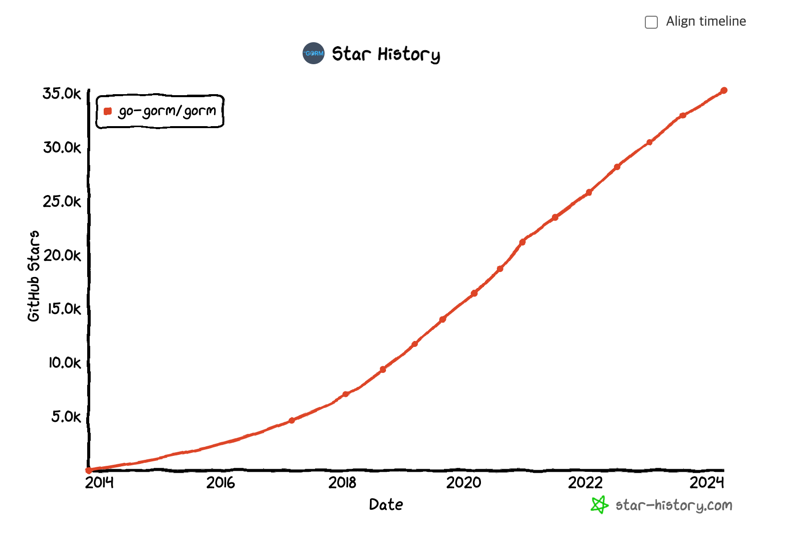

## Gorm
* Go 언어의 대표적인 ORM 라이브러리 입니다.
* Go 언어 1.0의 출시(2012) 출시 후 2년 뒤에 시작한 라이브러리 입니다.


## 개요
* 완전한 기능을 가진 ORM (지향?)
* 연관관계 지원 
  * Has One(one-to-one)
  * Has Many(one-to-many)
  * Belongs To(manty-to-one)
  * Many To Many
  * Polymorphism
  * Single-table inheritance
* Hooks (Before/After Create/Save/Update/Delete/Find)
* Preload, Joins를 통한 데이터 가져오기
* Transactions, Nested Transactions, Save Point, RollbackTo to Saved Point
* Context, Prepared Statement 모드, DryRun 모드
* Batch Insert, FindInBatches, Find/Create with Map, CRUD with SQL Expr and Context Valuer
* SQL Builder, Upsert, Locking, Optimizer/Index/Comment Hints, Named Argument, SubQuery
* Composite Primary Key, Indexes, Constraints
* Auto Migrations
* Logger
* 확장 가능하고 유연한 플러그인 API: Database Resolver (다중 데이터베이스, 읽기 / 쓰기 분할) / Prometheus

## 설치
```go
go get -u gorm.io/gorm
go get -u github.com/go-sql-driver/mysql
```

## 준비
```sql
create database gorm;
```

## 설정
* GORM은 MySQL, PostgreSQL, SQLite, SQL Server, TiDB 를 지원합니다.  
* GORM이 사용할 데이터소스를 설정은 전체 시스템에서 1회만 실행해야 합니다. 
```go
package main

import (
    "context"
    "fmt"
    "gorm.io/driver/mysql" //"github.com/go-sql-driver/mysql" 를 import 하지 않습니다. 내부에서 mysql 드라이버를 사용하고 있습니다.
    "gorm.io/gorm"
    "time"
)

func initGorm() *gorm.DB {
	cfg := mysql.Config{
		DSN: "root:test@tcp(localhost:3306)/gorm?charset=utf8&parseTime=True&loc=Local",
	}
	var err error

	db, err := gorm.Open(mysql.New(cfg), &gorm.Config{})
	if err != nil {
		panic("Db 연결에 실패하였습니다.")
	}

	sqlDb, err := db.DB()
	if err != nil {
		panic(err)
	}

	sqlDb.SetMaxIdleConns(100)
	sqlDb.SetMaxOpenConns(100)
	sqlDb.SetConnMaxIdleTime(1 * time.Hour) // idle 상태로 유지되는 시간
	sqlDb.SetConnMaxLifetime(1 * time.Hour) // connection의 재사용 가능 시간

	// 테이블 자동 생성
	err = db.AutoMigrate(&model.Student{})
	if err != nil {
		panic(err)
	}

	return db
}
```

## CRUD
### INSERT
* 레코드 생성은 Create 함수를 사용합니다. 
* 매개변수의 타입은 value interface{} 이므로 아무 타입이나 입력할 수 있지만 처리 후에 데이터를 변경해야 하므로 반드시 포인터를 전달해야 합니다. 
* crud.go Insert 함수
```go
func Insert(db *gorm.DB, student *model.Student) (id uint, rowsAffected int64) {
    tx := db.Create(student) 
    if tx.Error != nil { // 에러를 반환합니다
        fmt.Println(db.Error)
    }
    return student.ID, tx.RowsAffected // 입력된 데이터의 primary key, 레코드 개수를 반환합니다
}
```
* 만약, 여러개의 레코드를 Insert 하고자 한다면 포인터 슬라이스를 매개 변수로 넘겨 주면 됩니다.
```go
func Inserts(db *gorm.DB, students []*model.Student) (rowsAffected int64) {
	tx := db.Create(students)
	if tx.Error != nil {
		fmt.Println(db.Error)
	}
	return tx.RowsAffected
}
```

### UPDATE - SAVE
* Save는 변수 필드에 프라이머리 키 값이 포함되어 있으면 업데이트를 처리하고 만약 빈값이면 인서트를 처리합니다. 
```go
db.Save(&User{Name: "zbum", Age: 100})
// INSERT INTO `users` (`name`,`age`,`birthday`,`update_at`) VALUES ("zbum",100,"0000-00-00 00:00:00","0000-00-00 00:00:00")

db.Save(&User{ID: 1, Name: "zbum", Age: 100})
// UPDATE `users` SET `name`="zbum",`age`=100,`birthday`="0000-00-00 00:00:00",`update_at`="0000-00-00 00:00:00" WHERE `id` = 1
```

### UPDATE
* 단일 레코드를 수정할때는 Update 메소드를 사용합니다. Update 는 Model 의 값에 기본 키값이 있는 경우, 그 키를 사용합니다. 
* 만약 Update 시에 조건절이 없다면 ErrMissingWhereClause 가 발생합니다.
```go
// Update with conditions
db.Model(&User{}).Where("active = ?", true).Update("name", "hello")
// UPDATE users SET name='hello', updated_at='2013-11-17 21:34:10' WHERE active=true;

// User's ID is `111`:
db.Model(&user).Update("name", "hello")
// UPDATE users SET name='hello', updated_at='2013-11-17 21:34:10' WHERE id=111;

// Update with conditions and model value
db.Model(&user).Where("active = ?", true).Update("name", "hello")
// UPDATE users SET name='hello', updated_at='2013-11-17 21:34:10' WHERE id=111 AND active=true;
```

* 구조체 또는 맵을 이용하여 업데이트 가능합니다. 구조체를 사용한 경우, 제로벨류는 사용하지 않습니다. 
```go
// Update attributes with `struct`, will only update non-zero fields
db.Model(&user).Updates(User{Name: "hello", Age: 18, Active: false})
// UPDATE users SET name='hello', age=18, updated_at = '2013-11-17 21:34:10' WHERE id = 111;

// Update attributes with `map`
db.Model(&user).Updates(map[string]interface{}{"name": "hello", "age": 18, "active": false})
// UPDATE users SET name='hello', age=18, active=false, updated_at='2013-11-17 21:34:10' WHERE id=111;

```

### DELETE
* 삭제는 반드시 primary 키가 값이 있어야 동작합니다. 만약 primary 키 없이 여러건을 삭제할 때는 BATCH DELETE를 사용합니다.
```go
db.Delete(&User{}, 10)
// DELETE FROM users WHERE id = 10;

db.Delete(&User{}, "10")
// DELETE FROM users WHERE id = 10;

db.Delete(&users, []int{1,2,3})
// DELETE FROM users WHERE id IN (1,2,3);

```

### BATCH DELETE
```go
db.Where("email LIKE ?", "%jinzhu%").Delete(&Email{})
// DELETE from emails where email LIKE "%jinzhu%";

db.Delete(&Email{}, "email LIKE ?", "%jinzhu%")
// DELETE from emails where email LIKE "%jinzhu%";
```

### Soft DELETE
* 필드에 gorm.DeletedAt 이 포함되어 있다면 자동으로 Soft DELETE 가 처리됩니다.
* Delete 메소드가 호출되면 실제 데이터를 삭제하지 않고 DeletedAt 필드에 현재시작을 등록합니다.
* 일반적인 Query 메소드로는 해당 레코드를 조회할 수 없습니다.

* Soft DELETE 한 레코드 조회하기
```go
db.Unscoped().Where("age = 20").Find(&users)
// SELECT * FROM users WHERE age = 20;
```

* Soft DELETE 레코드 삭제하기
```go
db.Unscoped().Delete(&order)
// DELETE FROM orders WHERE id=10;
```


