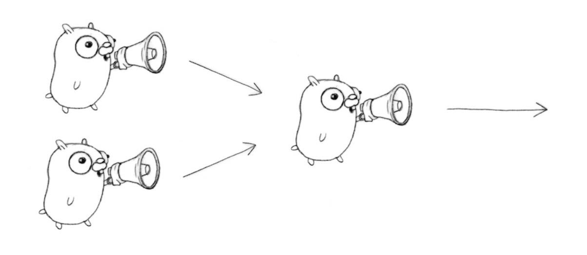

## 동시성 패턴 - Generator
* 함수가 채널을 생성하고 반환합니다. 

```go
func main() {
	c := boring("boring!") // 채널을 반환하는 함수
	for i := 0; i < 5; i++ {
		fmt.Printf("You say: %q\n", <-c)
	}
	fmt.Println("You're boring; I'm leaving.")
}

func boring(msg string) <-chan string { // 읽기 전용 채널을 반환합니다.
	c := make(chan string)
	go func() {
		for i := 0; ; i++ {
			c <- fmt.Sprintf("%s %d", msg, i)
			time.Sleep(time.Duration(rand.Intn(1e3)) * time.Millisecond)
		}
	}()
	return c
}

```

## FanIn
* 다음 코드는 boring 함수를 두번 호출해서 결과 채널을 표시합니다. 
* 이 경우, <-joe, <-ann 에서 락스텝이 발생하여 먼처 처리한 고루틴도 대기하는 상황이 발생합니다. 
```go
func main() {
    joe := boring("Joe")
    ann := boring("Ann")
    for i := 0; i < 5; i++ {
        fmt.Println(<-joe)
        fmt.Println(<-ann)
    }
    fmt.Println("You're both boring; I'm leaving.")
}
```
* output
```
Joe 0
Ann 0
Joe 1
Ann 1
Joe 2
Ann 2
Joe 3
Ann 3
Joe 4
Ann 4
You're both boring; I'm leaving.

```
* 이경우 fanin 함수를 하용하여 먼저 처리된 결과를 먼저 받게 할 수 있습니다.
```go
func main() {
    c := fanIn(boring("Joe"), boring("Ann"))
    for i := 0; i < 10; i++ {
        fmt.Println(<-c)
    }
    fmt.Println("You're both boring; I'm leaving.")
}

func fanIn(input1, input2 <-chan string) <-chan string {
	c := make(chan string)
	go func() {
		for {
			c <- <-input1
		}
	}()
	go func() {
		for {
			c <- <-input2
		}
	}()
	return c
}
```



> Go 에서 다양한 동시성 패턴을 제공하고 있으니 아래 링크를 참고 바랍니다. 

## 출처
* https://go.dev/talks/2012/concurrency.slide#1